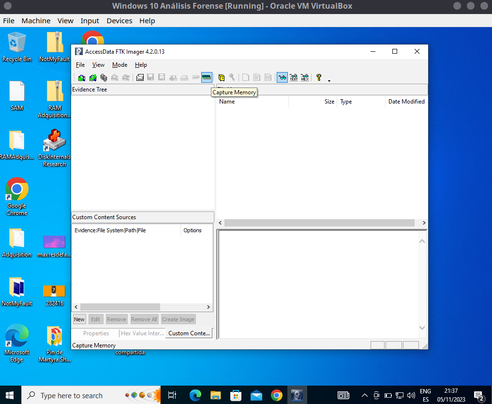
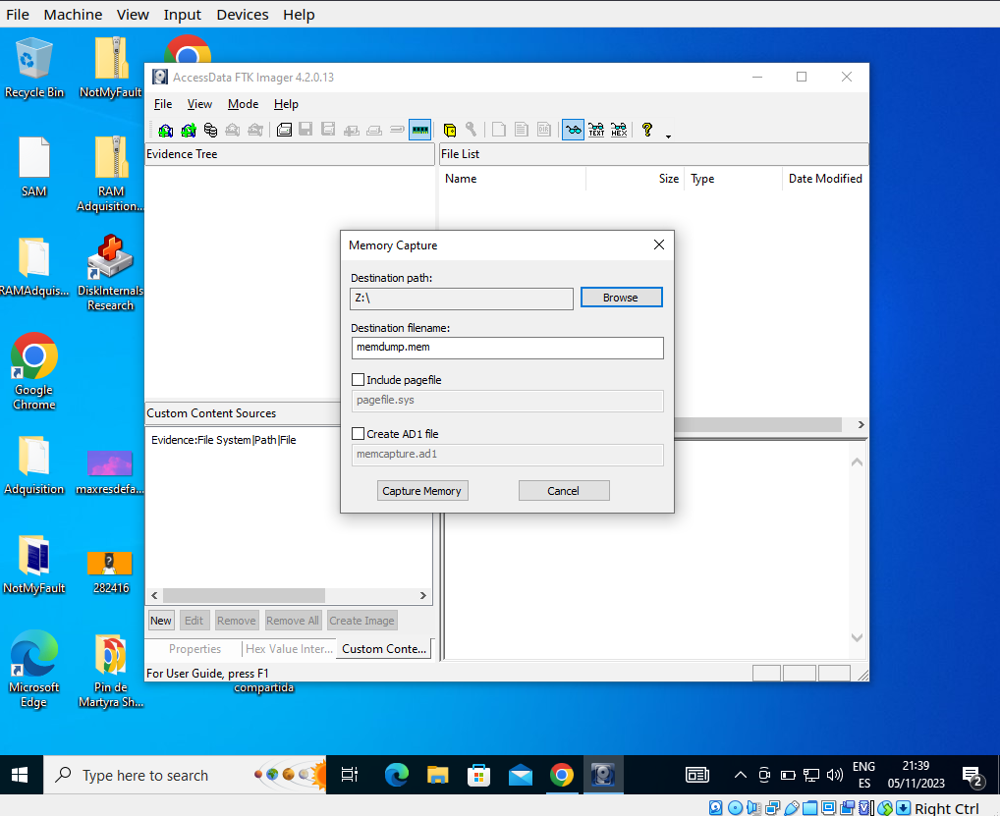
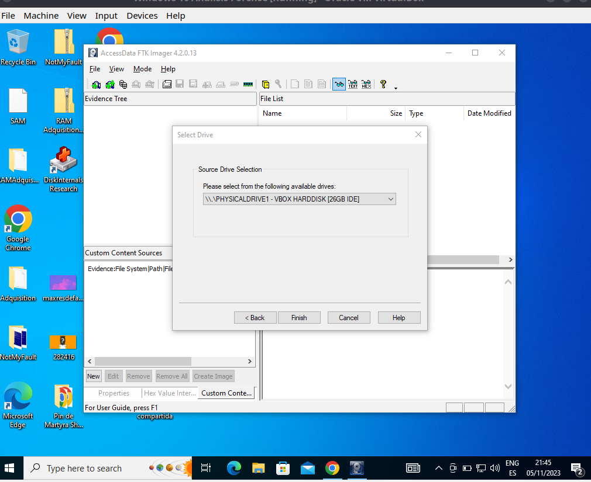
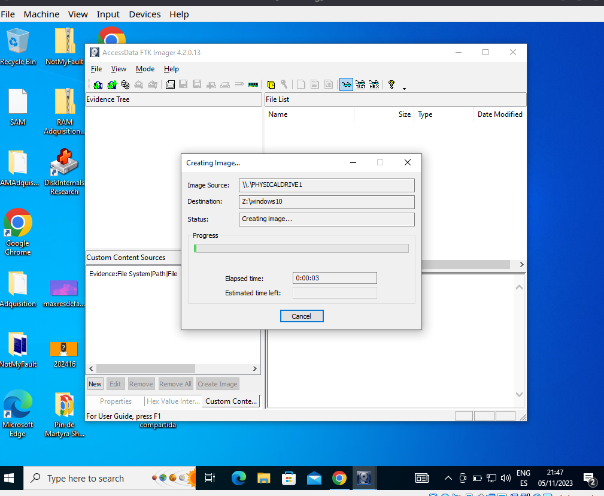
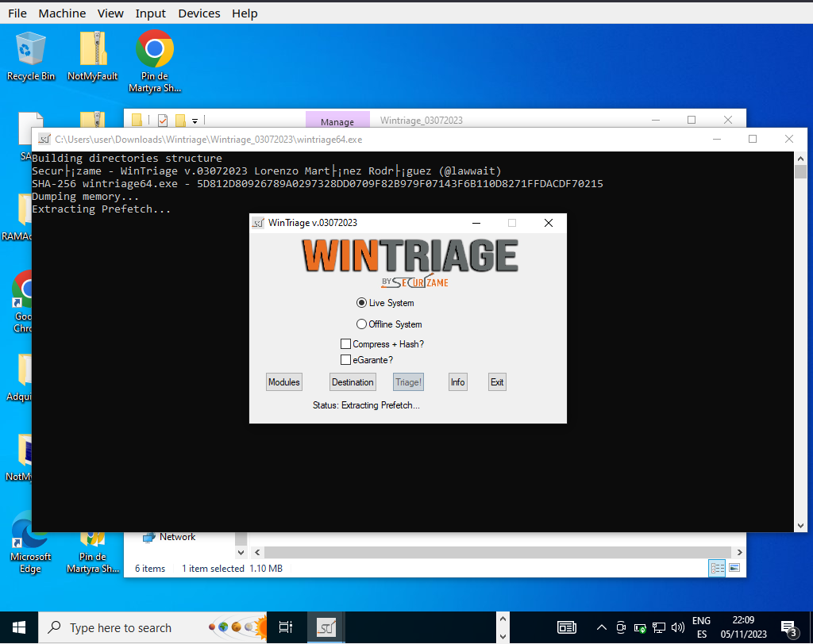
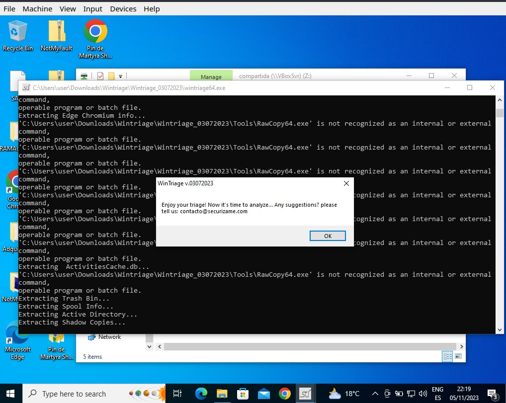
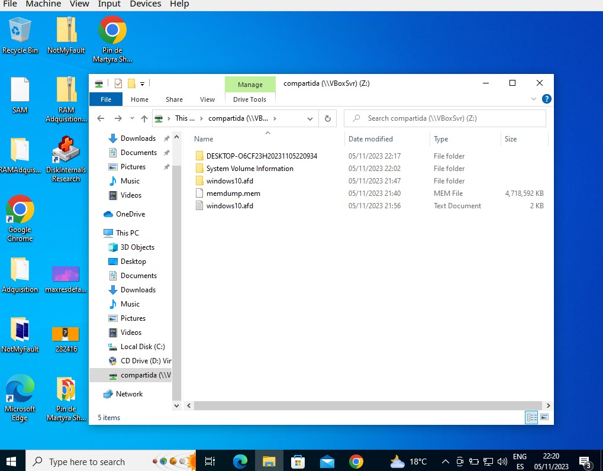

# Adquisición forense en vivo de una máquina Windows 10

## Introducción

En este documento se resume brevemente el proceso de adquisición en vivo, es decir, con la máquina encendida, de la memoria volátil y no volátil de la máquina usando **Access Data FTK Imager** , asi como la aplicación de un proceso de triaje mediante la herramienta **WinTriage**.

Durante el proceso se aplicará en la medida de lo posible, ya que en este caso tenemos un escenario muy acotado, la metodología que hemos desarrollado en grupo para realizar las adquisiciones. 

## Preparación y reconocimento

En la primera fase de nuestra metodología tratamos de tener en cuenta el escenario con el que nos encontramos y evaluar nuestro proceder en base a ello. Estamos frente a una máquina Windows 10 encendida, estaremos trabajando con una máquina virtual de nuestro equipo. En primer lugar, si queremos realizar una extracción de calidad, bajo ningún concepto podríamos apagarla. 

Debemos intentar actuar con la máxima precaución alterando lo más mínimo los procesos y memoria volátil de la máquina. Tan solo haremos lo necesario, que será instalar nuestras herramientas, **FTK** y **WinTriage**, desde un dispositivo externo previamente preparado. Tan solo usaremos estas dos herramientas porque FTK nos permite además de hacer una imagen de disco, realizar una adquisición de la memoria volátil, y nos ahorra el tener que instalar una herramienta específicamente para éste propósito.

Con nuestras herramientas preparadas, procedemos con la adquisición.

## Planteamiento de la Adquisición

En primer lugar debemos de tener en cuenta qué vamos a hacer primero, en base a los criterios que recogimos en nuestra metodología de *valor probable, volatilidad y cantidad de esfuerzo requerido*. 

Con esto en mente, lo mejor es proceder a en primer lugar realizar una adquisición de la memoria volátil (RAM) mediante FTK debido a ser la memoria más volátil, a tener una sencilla extracción y tener un valor probable considerable, para luego continuar la creación de una imagen del disco de la máquina también con **FTK**, que es menos volátil que la ram, y también nos aportará datos probablemente valiosos con un esfuerzo pequeño. 

Una vez hayamos extraídos los datos, podremos aplicar el proceso de triage con la herramienta **WinTriage**, ya que considero que la herramienta podría alterar la integridad de los datos al empezar a ejecutar las operaciones necesarias.

## Adquisición

Con esta planificación procedemos a realizar la adquisición en la máquina, en primer lugar preparamos una memoria USB protátil con nuestras herramientas FTK y WinTriage.

Introducimos la memoria en la máquina y tan solo ejecutamos FTK para alterar lo mínimo los datos y mantener el nivel de integridad tan alto como sea posible. FTK es una herramienta autoportable por lo que con tan solo estar cargada en la memoria USB ya podríamos usarla. Pulsamos sobre el icono de la memoria RAM que nos indica "*Capture Memory*". 

Elegimos el disco :Z de la máquina virtual ya que es una carpeta compartida con mi equipo, para tener espacio de almacenamiento suficiente para las copias, que serán grandes, especialmente la del disco duro. Simulamos además la extracción de los datos en un disco externo, proceso que deberíamos tener en cuenta ya que la incorporación de los datos extraídos al mismo equipo donde se están extrayendo podrían causar una alteración de la composición original e integridad de los datos.

Nada mas terminar la adquisición de RAM, procedemos a realizar una imagen de disco también con FTK pulsando sobre *File/Create Disk Image* y seleccionamos el disco principal de la máquina virtual. Elegiremos el formato AFF para la extracción

Seleccionamos también el disco Z, añadimos  metadatos de la adquisición y procedemos. Esta adquisición tardará más debido a que este disco es mayor que la memoria RAM.

Una vez con los datos asegurados y adquiridos con éxito, procedemos a realizar el triaje de la máquina. Para esto es importante desactivar el antivirus ya que muchas de las herramientas de triaje entran en conflicto directo con ellos. 

Procedemos a desactivar windows defender, también por supuesto debemos ejecutar con privilegios de administrador. Empezamos a trabajar con la herramienta WinTriage, esta sí que debemos moverla a la máquina a diferencia de FTK. WinTriage requiere de múltiples herramientas auxiliares que deberíamos de instalar para sacarle el máximo provecho.

Esperamos a que se complete el proceso y nos indicará al final con un mensaje que hemos terminado.

De esta manera ya tendríamos realizada nuestra adquisición en vivo de una máquina Windows 10, aquí podríamos ver los archivos resultantes en la carpeta compartida que simularía el disco externo donde habríamos recopilado los datos para su posterior análisis.

Siguiendo con nuestra metodología es fundamental ahora etiquetar y preservar estos datos adecuadamente, así como indicar que yo fui quien los estaba manipulando para preservar la cadena de custodia.

